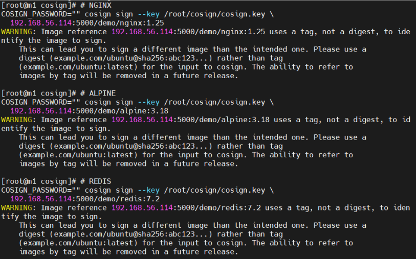
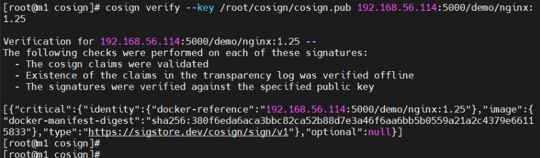
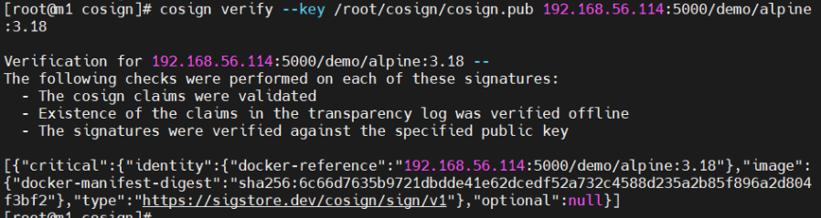
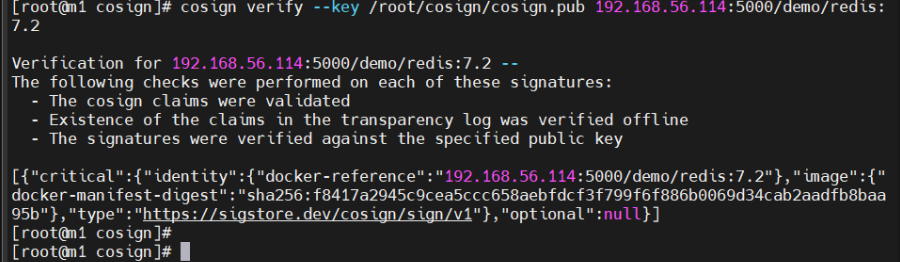

# 🧾 Cosign
Cosign es una herramienta de **Sigstore** que simplifica la firma y verificación de contenedores y otros artefactos de software. Es esencial para la implementación de políticas de seguridad en pipelines CI/CD y entornos de Kubernetes.


---

## ⚙️ Guía de Instalación de Cosign

Antes de instalar, asegúrate de tener privilegios de `root` y las siguientes dependencias:
```bash
sudo dnf install -y curl wget tar podman containerd jq
```

---

### 🧩 Método 1: Instalación desde repositorio (recomendada)

Instala Cosign usando el gestor de paquetes DNF:

```bash
sudo dnf install -y cosign
```

Verificar versión instalada
```bash
cosign version
```

Mostrar información binaria (ruta y hash)
```bash
which cosign
sha256sum $(which cosign)
```

**✅ Si obtienes un número de versión (por ejemplo cosign: 2.2.1), la instalación fue exitosa.
**

### 🧩 Método 2: Instalación binaria desde GitHub
Instala la versión más reciente directamente desde los releases oficiales de Sigstore:
```bash
sudo curl -sSL -o /usr/local/bin/cosind \
https://github.com/sigstore/cosign/releases/latest/download/cosign-linux-amd64

sudo chmod +x /usr/local/bin/cosind
sudo install -m 0755 /usr/local/bin/cosind /usr/local/bin/cosign
```

Verificar versión instalada
```bash
cosign version
```

**⚠️ Importante:**
Se recomienda utilizar Cosign v2.2.x o versiones similares.
Evita versiones superiores a esta debido a incompatibilidades con Connaisseur.

### 🔎 Validar instalación con prueba rápida
Mostrar ayuda general
```bash
cosign help
```

Probar generación de clave de ejemplo temporal
```bash
COSIGN_EXPERIMENTAL=1 cosign generate-key-pair k8s-test
```
Salida esperada:
```bash
Enter password for private key: 
Enter password for private key again:
Private key written to k8s-test.key
Public key written to k8s-test.pub
```

Elimina los archivos temporales después de probar:
```bash
rm -f k8s-test.key k8s-test.pub
```

---

## 🔐 Configuración para firma manual
### A) Subir un registro local en m1 para alojar imágenes y firmas
Esto evita el uso de credenciales externas (como Docker Hub) y permite la integración con Connaisseur.

Instalar Podman
```bash
sudo dnf install -y podman
```

Crear directorio para el registro local
```bash
sudo mkdir -p /var/lib/registry
```

Levantar el contenedor del registro
```bash
sudo podman run -d --name registry --restart=always -p 5000:5000 \
  -v /var/lib/registry:/var/lib/registry registry:2
```

Configurar firewall
```bash
- sudo firewall-cmd --add-port=5000/tcp --permanent
- sudo firewall-cmd --reload
```

Prueba rápida
```bash
curl http://127.0.0.1:5000/v2/
```

**Salida esperada: {}**

Verifica que el contenedor esté ejecutándose correctamente:
```bash
sudo podman ps --filter "name=registry"
```

### B) Configurar Containerd para Permitir "Plain HTTP"
```
sudo mkdir -p /etc/containerd/certs.d/192.168.56.114:5000

sudo tee /etc/containerd/certs.d/192.168.56.114:5000/hosts.toml >/dev/null <<'EOF'
server = "http://192.168.56.114:5000"
[host."http://192.168.56.114:5000"]
  capabilities = ["pull", "resolve", "push"]
  skip_verify = true
EOF

sudo systemctl restart containerd
```
Ejecutar este bloque en todos los nodos del clúster o localmente para permitir pull/push al registro sin TLS.

Comprobación:
```bash
crictl info | grep -A2 "config_path"
```

### C) Generar el par de claves (privada/pública)
```
mkdir -p /root/cosign
cd /root/cosign
cosign generate-key-pair
```

Se generarán los archivos cosign.key (privada) y cosign.pub (pública).
Validar contenido:
```
ls -lh /root/cosign/
openssl rsa -in /root/cosign/cosign.key -check
```

### D) Preparar imágenes de prueba en el registro local
**NGINX**
```
sudo podman pull docker.io/library/nginx:1.25
sudo podman tag docker.io/library/nginx:1.25 192.168.56.114:5000/demo/nginx:1.25
sudo podman push --tls-verify=false 192.168.56.114:5000/demo/nginx:1.25
```

**ALPINE**
```
sudo podman pull docker.io/library/alpine:3.18
sudo podman tag docker.io/library/alpine:3.18 192.168.56.114:5000/demo/alpine:3.18
sudo podman push --tls-verify=false 192.168.56.114:5000/demo/alpine:3.18
```

**REDIS**
```
sudo podman pull docker.io/library/redis:7.2
sudo podman tag docker.io/library/redis:7.2 192.168.56.114:5000/demo/redis:7.2
sudo podman push --tls-verify=false 192.168.56.114:5000/demo/redis:7.2
```

Verificar que el registro las detecte:
```
curl http://192.168.56.114:5000/v2/_catalog
curl http://192.168.56.114:5000/v2/demo/nginx/tags/list
```

### E) Firmar imágenes con Cosign (clave local)
**NGINX**
```
COSIGN_PASSWORD="" cosign sign --key /root/cosign/cosign.key \
  192.168.56.114:5000/demo/nginx:1.25
```

**ALPINE**
```
COSIGN_PASSWORD="" cosign sign --key /root/cosign/cosign.key \
  192.168.56.114:5000/demo/alpine:3.18
```

**REDIS**
```
COSIGN_PASSWORD="" cosign sign --key /root/cosign/cosign.key \
  192.168.56.114:5000/demo/redis:7.2
```



Cosign generará firmas OCI en el mismo registro.
Puedes verlas con `curl -s http://192.168.56.114:5000/v2/demo/redis/tags/list.`

### F) Verificar firmas con la clave pública
```
cosign verify --key /root/cosign/cosign.pub \
  192.168.56.114:5000/demo/nginx:1.25 --verbose
```


```
cosign verify --key /root/cosign/cosign.pub \
  192.168.56.114:5000/demo/alpine:3.18 --verbose
```


```
cosign verify --key /root/cosign/cosign.pub \
  192.168.56.114:5000/demo/redis:7.2 --verbose
```


Si la imagen no está firmada, Cosign mostrará:
`error: no matching signatures`

---

## 🧩 Ejemplo: Firmar imagen manualmente
```bash
echo "=== Antes de firmar ==="
cosign verify --key /root/cosign/cosign.pub 192.168.56.114:5000/demo/redis:7.2 || echo "❌ No firmada todavía"

echo "=== Firmando imagen ==="
COSIGN_PASSWORD="" cosign sign --key /root/cosign/cosign.key 192.168.56.114:5000/demo/redis:7.2

echo "=== Verificando después de firmar ==="
cosign verify --key /root/cosign/cosign.pub 192.168.56.114:5000/demo/redis:7.2
```

Mostrar tags y artefactos generados:
```
curl -s http://192.168.56.114:5000/v2/demo/redis/tags/list | jq
```

---

## 🧠 Comandos adicionales útiles
Mostrar contenido de firma:
```
cosign verify --key /root/cosign/cosign.pub 192.168.56.114:5000/demo/nginx:1.25 --output text
```

Exportar clave pública en base64 (útil para Connaisseur)
```
base64 -w0 /root/cosign/cosign.pub
```

Verificar integridad de clave privada
```
openssl rsa -in /root/cosign/cosign.key -check
```
