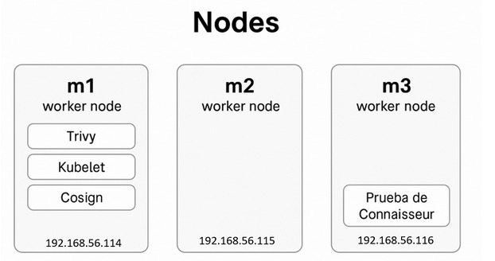

# 🔐 Seguridad de Imágenes en Contenedores con Trivy, Cosign y Connaisseur
---

## 👥 Integrantes del Equipo

- Colin Mosqueda Eduardo  
- Patiño Oseguera Alexis  

---

## 📘 Descripción del Proyecto

Este proyecto integra tres herramientas esenciales para la seguridad de imágenes en contenedores y despliegues en Kubernetes: **Trivy**, **Cosign** y **Connaisseur**.  
Su propósito es implementar un flujo completo de **DevSecOps** que permita escanear vulnerabilidades, firmar digitalmente imágenes de contenedores y validar dichas firmas antes del despliegue, garantizando la integridad y autenticidad del software.

- **Trivy** analiza vulnerabilidades conocidas en imágenes, archivos y dependencias.  
- **Cosign** firma y verifica imágenes de contenedores mediante criptografía segura (RSA/Ed25519).  
- **Connaisseur** actúa como un *admission controller* que bloquea imágenes no firmadas o alteradas al momento de desplegar en Kubernetes.

Este entorno demuestra cómo fortalecer la **cadena de suministro de software (Supply Chain Security)**, aplicando buenas prácticas de acuerdo con estándares como **SLSA** y **NIST 800-218**.

## 🔧 Requisitos del Proyecto

| Componente | Descripción | Comando de Verificación |
|-------------|--------------|--------------------------|
| **Kubernetes** | Versión 1.24 o superior, con 1 nodo control-plane y al menos 2 worker nodes. | `kubectl get nodes -o wide` |
| **CNI (Flannel o Calico)** | Red configurada y en estado Ready. | `kubectl get pods -n kube-flannel` |
| **Helm 3** | Requerido para instalar Connaisseur. | `helm version` |
| **kubectl** | Configurado con el contexto del clúster actual. | `kubectl config current-context` |
| **Container Runtime** | `containerd` o `docker`, requerido para manejar imágenes locales. | `systemctl status containerd` |
| **Podman o Docker CLI** | Necesario para subir imágenes al registro local. | `podman version` |
| **Acceso root o sudo** | Requerido para modificar configuraciones del sistema. | `whoami` |
| **Firewall** | El puerto **5000** debe estar abierto para permitir el registro local HTTP. | `sudo firewall-cmd --list-ports` |

---

## 🏗️ Entorno Utilizado en el Proyecto

### 🔹 Infraestructura General

- **Sistema operativo base:** Rocky Linux 9.6 (Blue Onyx)  
- **Motor de contenedores:** containerd  
- **Registro local:** Registry:2 ejecutándose en el puerto 5000  
- **Red privada:** 192.168.56.0/24  

---

### 🔹 Configuración de Nodos

| Nodo | IP | Rol | Función |
|------|----|-----|----------|
| **m1** | 192.168.56.114 | Control-plane | Nodo principal del clúster. Aloja el registro local (puerto 5000) y ejecuta Trivy, Cosign y Connaisseur. |
| **m2** | 192.168.56.115 | Worker | Nodo secundario destinado al despliegue de pods de prueba y validación de imágenes firmadas. |
| **m3** | 192.168.56.116 | Worker | Nodo de pruebas para ejecución de pods con Connaisseur y validación final de imágenes firmadas. |

---

## 📂 Estructura de Directorios

| Directorio | Descripción |
|-------------|-------------|
| `/root/connaisseur/` | Contiene el archivo `values.yaml` con la configuración del Helm Chart y políticas. |
| `/root/cosign/` | Almacena las claves `cosign.key` y `cosign.pub` para firma y verificación. |
| `/root/reports/` | Guarda los reportes de vulnerabilidades generados por Trivy (HTML y JSON). |
| `/root/connaisseur/tests/` | Contiene los manifiestos de prueba: `fail-unsigned.yaml` y `ok-signed.yaml`. |

---

> 💡 **Nota:** Este repositorio es parte de un entorno educativo orientado a la implementación práctica de medidas de seguridad en la cadena de suministro de software mediante herramientas open source.

